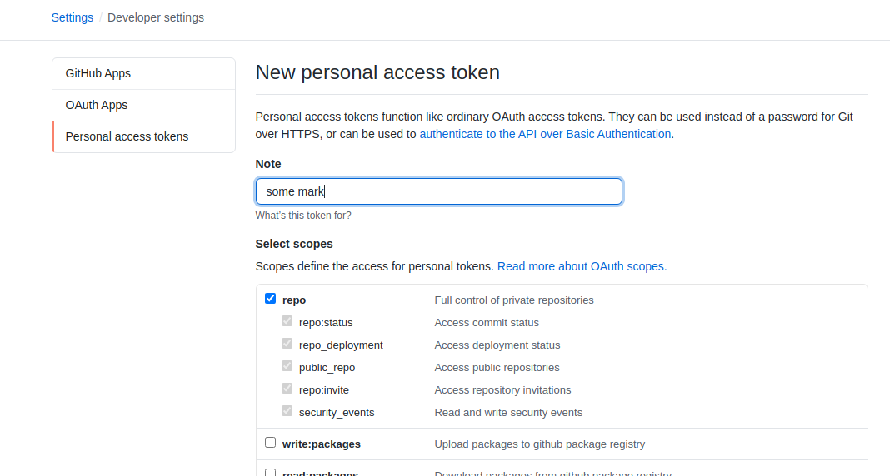

# Awesome Elixir

[тестовое задание elixir Funbox](https://dl.funbox.ru/qt-elixir.pdf)

## Локальная установка

### Зависимости

- [asdf](https://github.com/asdf-vm/asdf) - мулти менеджер версий erlang, elixir, nodejs
- [postgresql](https://www.postgresql.org/) - SQL база данных
- [direnv](https://direnv.net/) - менеджер переменных окружения

### Установка

```bash
git clone git@github.com:IvanAnanev/ae.git && cd ae
asdf install
cp .envrc.example .envrc
```

На этом этапе нужно будет отредакстировать `.envrc`, установив значение `GITHUB_TOKEN`, который можно создать на странице своего `github` профиля [settings/tokens](https://github.com/settings/tokens).



```bash
direnv allow .
mix deps.get
mix setup
```

### Запуск

```bash
mix phx.server
```

### Тестирование

```bash
mix test
# при разработке
mix test.watch
```
